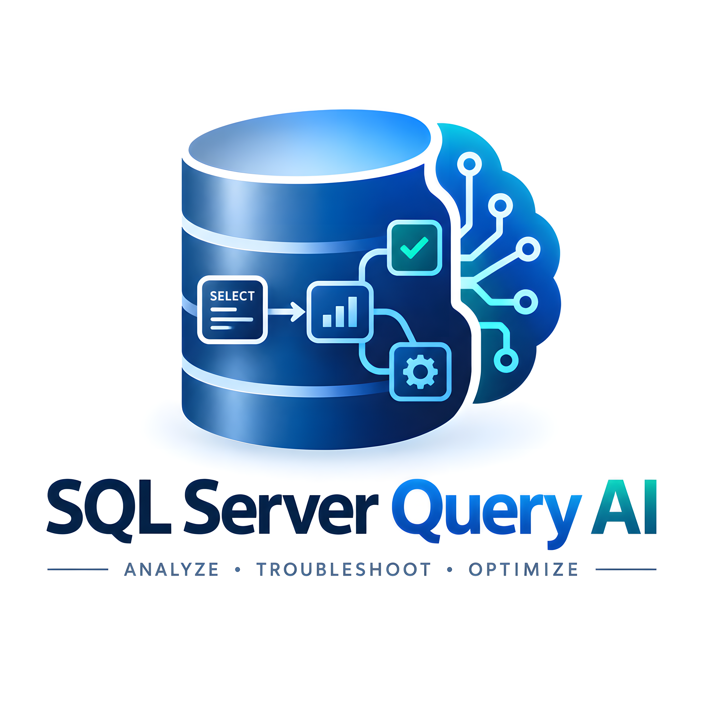
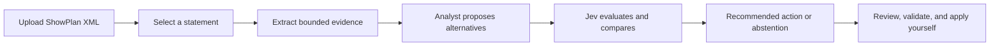

<div align="center">
  

# SQL Server Query AI

**Understand the plan. Compare the options. Choose the next action.**

An AI workspace for SQL Server execution plans, with an OpenAI-compatible analyst and Jev as the decision engine.

[](https://hub.docker.com/r/worlber/sql-server-query-al)


[Quick start](#quick-start-with-docker) · [How it works](#how-it-works) · [Model setup](#configure-your-models) · [Privacy](#your-data-and-credentials) · [Development](#run-from-source)

</div>

## What it does

Upload a SQL Server execution plan and turn its evidence into a practical troubleshooting report. The analyst generates alternative remedies; **Jev evaluates those alternatives and selects a first action—or explicitly declines to choose when the evidence is insufficient**.

Each option includes its diagnosis, supporting evidence, prerequisites, suggested SQL, expected effect, validation steps, and rollback guidance. You review the recommendation and decide what to run. **The app does not connect to SQL Server or execute SQL.**

- **Large execution plans:** actual and estimated ShowPlan XML, multiple statements, and uploads up to 100,000,000 bytes.
- **Evidence per statement:** operators, runtime counters, estimate mismatches, warnings, waits, tables, and missing indexes.
- **Several remedies:** compare two to four options instead of relying on one generated answer.
- **Jev decisions:** evaluate fit, semantic safety, operational effort, and root-cause relevance, with separate evidence and safety checks.
- **A focused workspace:** light/dark themes, responsive sidebar, searchable history, account settings, SQL copy, and print/PDF export.
- **Saved work:** revisit reports or retry Jev using the existing evidence and alternatives.

## How it works



1. **Parse:** stream the XML to disk and parse it in a worker, keeping large files out of browser text fields.
2. **Focus:** select the statement to investigate. The highest estimated subtree cost is suggested; this is an estimate, not measured execution time.
3. **Propose:** send bounded statement evidence to your analyst model. It returns alternatives with evidence references and concrete next steps.
4. **Decide:** Jev checks evidence support and operational safety, scores the options, and chooses among eligible actions and an explicit no-action choice.
5. **Explain:** display the original candidate SQL and a structured action plan. A separate writing model cannot silently change the selected SQL.

Before any model is involved, **rule-based checks** flag known plan problems: key lookups, parameter sensitivity, oversized memory grants, tempdb spills, implicit conversions, residual predicates, bad row estimates, stale statistics, scalar UDFs and table variables. The analyst explains these findings instead of guessing. Each option's T-SQL is then **checked in code**: tables and columns must appear in the plan, index names must not already exist, and the SQL must be well-formed. Safety and effort for plain nonclustered indexes and statistics changes are set by rule; Jev judges the rest.

Every option comes with a **validation script**: a baseline with `SET STATISTICS IO, TIME`, the plan's parameter values, checks of existing indexes and statistics, the change, a re-measure, an `EXCEPT` result comparison for rewrites, Query Store history, and the rollback. After applying an option, upload the new plan under **Did it work?** to compare measured time, reads, memory and findings with the original.

If Jev abstains or is unavailable, the report shows **no selected winner**. Scores and confidence help explain the decision; they do not prove correctness or guarantee better database performance.

## Quick start with Docker

You need Docker Engine or Docker Desktop. The published image currently targets **Linux AMD64**. Other CPU architectures require compatible emulation or a source build; a native ARM64 image has not been published.

### 1. Pull the image

```bash
docker pull worlber/sql-server-query-al:latest
```

For a fixed release, use `worlber/sql-server-query-al:20260922` instead of `latest`.

### 2. Create a runtime secret

Run these commands once in a new deployment directory. Keep the generated file private and preserve it for future upgrades.

```bash
mkdir sql-server-query-ai
cd sql-server-query-ai
umask 077
printf 'APP_SECRET=%s\n' "$(openssl rand -hex 32)" > .env
```

`APP_SECRET` encrypts saved model credentials. **Do not regenerate it when restarting or upgrading an existing installation.** It belongs in your deployment environment, never in Git or a Docker image.

### 3. Start the container

```bash
docker volume create sql-server-query-ai-data

docker run -d \
  --name sql-server-query-ai \
  --restart unless-stopped \
  -p 3000:3000 \
  --env-file .env \
  -e DATA_DIR=/data \
  -v sql-server-query-ai-data:/data \
  worlber/sql-server-query-al:latest
```

Open **http://localhost:3000**. On a remote machine, replace `localhost` with its hostname or IP address.

The image starts with no accounts, provider keys, or analysis history. Create your account and complete the three-step setup guide.

### 4. Check the service

```bash
docker ps --filter name=sql-server-query-ai
docker logs --tail 100 sql-server-query-ai
curl -fsS http://localhost:3000/api/healthz
```

The health endpoint returns `{"ok":true}`. The container also has a built-in health check.

## Docker Compose

Clone this repository, then create a private `.env` containing a generated `APP_SECRET`, as shown above:

```bash
git clone https://github.com/ahmedalkhair64bit/sql-server-query-al.git
cd sql-server-query-al
umask 077
printf 'APP_SECRET=%s\n' "$(openssl rand -hex 32)" > .env

docker compose pull
docker compose up -d --no-build
```

The included Compose file uses the published, pinned image, exposes port 3000, and persists `/data` in a named volume. To select a different published tag, set `QAI_IMAGE` in `.env`:

```dotenv
QAI_IMAGE=worlber/sql-server-query-al:latest
```

To build from source instead:

```bash
docker compose up -d --build
```

## Configure your models

After signing up, the setup guide walks through three steps: what the app does, connecting both models, and a check that both actually answer. You can change everything later under **Settings → Models**. Each user has their own saved configuration.

| Field                       | What to enter                                                                                                                          |
| --------------------------- | -------------------------------------------------------------------------------------------------------------------------------------- |
| Provider                    | OpenAI, Azure OpenAI, Google Gemini, OpenRouter, Ollama, vLLM, or any other OpenAI-compatible API. Choosing one fills in the base URL. |
| Base URL                    | The API root, usually ending in `/v1`. It must be reachable from inside the container.                                                 |
| API key                     | Your provider key. For a local endpoint without authentication, enter any text, such as `EMPTY`.                                       |
| Model                       | The exact model ID (for Azure, the deployment name). **Test analyst connection** lists the models your key can use.                    |
| Reasoning model switch      | Turn on for Qwen3, DeepSeek-R1 and similar models served by vLLM or SGLang; otherwise the answer arrives empty.                        |
| Maximum response length     | Leave empty for 4,096 tokens; raise it if answers are cut off.                                                                         |
| Advanced request parameters | Optional JSON merged into every analyst request, such as `{"temperature":0.2}`.                                                        |
| TypeSafe API key            | Your Jev key from [TypeSafe Console](https://console.typesafe.ai/keys).                                                                |
| Jev model                   | `jev-latest` unless you need a pinned version.                                                                                         |

Use the **Test** buttons before saving: each sends one tiny request and reports the real error (rejected key, unknown model, unreachable URL, timeout). The header shows **Models connected** only when both passed a test of the current settings. Inside a container, `localhost` refers to that container, not your host machine: use a reachable hostname, or `host.docker.internal` for services on the Docker host.

Saved keys are never shown again. **Leaving a key field empty keeps the saved key.** Provider keys are not passed as Docker build arguments.

**Privacy:** under Settings → Models you can stop sending the query text to the analyst model. Only plan evidence (operators, row counts, warnings, predicates, table and index names) is then sent, and query rewrites are not offered.

**Account and data:** changing your password requires the current one and signs out your other devices. Settings → Data exports every analysis as JSON, or deletes them all after you type `DELETE`.

## Analyze your first plan

1. In SQL Server Management Studio, save an actual or estimated execution plan as a `.sqlplan` file.
2. Choose **Upload a plan**, or paste ShowPlan XML for a small plan.
3. If the file contains several statements, select the one you want to investigate.
4. Add optional context: what is slow, what changed, and constraints on making changes.
5. Optional, recommended when you expect an index change: open **Existing indexes**, select **Copy query**, run that read-only query (system views only) in the plan's database, and paste its one JSON result. A plan names the indexes it used but not their keys or INCLUDE columns, so without this a suggested index can duplicate one the table already has. With it, a suggestion that an existing index already covers is dropped, one with the same keys becomes `CREATE INDEX ... WITH (DROP_EXISTING = ON)` extending that index (its rollback restores the original definition), and the models see every index and the table row counts.
6. Select **Analyse plan** and review the evidence, alternatives, and Jev decision.
7. Check prerequisites, validate the proposed SQL in your environment, and keep the rollback guidance available.

An analysis runs on the server, not in your browser tab: you can open Settings or another report while it runs, and its report fills in when it finishes (open it from history to watch its progress). **Stop analysis** ends a run on purpose; **Run again** restarts a stopped, failed or interrupted analysis from the same plan and note, with no new upload.

**Same plan, same answer.** Analysing a statement again with the same context note and the same model settings opens the earlier report instead of asking the models again, so the action plan does not change between runs and costs nothing. **Run again anyway** on that report asks the models afresh. The analyst is called with `temperature: 0` by default so fresh runs vary as little as the model allows; you can override it under the analyst's extra request parameters.

You can also reopen saved reports, rename or delete history entries, copy SQL, and use **Export to PDF** through your browser's print dialog.

## Your data and credentials

| Data                                  | Where it goes                                                                                                    |
| ------------------------------------- | ---------------------------------------------------------------------------------------------------------------- |
| Accounts, sessions, and saved reports | SQLite in your data volume.                                                                                      |
| Uploaded XML and statement indexes    | Files under `/data/plans` in Docker.                                                                             |
| Provider API keys                     | Encrypted with AES-256-GCM in SQLite using your runtime `APP_SECRET`.                                            |
| Model input                           | Bounded evidence, SQL text, object names, and your context note sent to the configured analyst and Jev services. |

**Bounded does not mean anonymized.** Plan evidence and SQL can contain sensitive schema names, literals, or business context. Use providers appropriate for your data. The original XML file is not sent wholesale to the models.

This public repository and the published image exclude deployment secrets, real databases, user sessions, analyzed production plans, and QA recordings. The one included plan fixture is synthetic and exists for automated tests. Internal development history containing runtime data is not part of this repository.

For an internet-facing installation, place the app behind HTTPS and appropriate network/access controls. The container runs as a non-root user.

- **Sign-up closes after the first account.** The first person to sign up owns the installation. To let a teammate create an account, restart with `ALLOW_SIGNUP=1`, then remove it again.
- **Failed sign-ins are throttled:** five failures lock that email for 15 minutes, and thirty failures from one address lock that address. The count is kept in memory and resets on restart.
- **Model URLs cannot target link-local or cloud metadata addresses** (`169.254.0.0/16`, `metadata.google.internal`, `fe80::/10`), checked after DNS resolution, and redirects are not followed. Loopback and private addresses stay allowed for Ollama and vLLM.

## Persistence, backup, and upgrades

Back up **both the entire data volume and the matching `APP_SECRET`**. Losing the secret makes saved model keys unreadable. A stopped-container or otherwise consistent volume backup is preferable to copying a live SQLite file alone.

For Compose upgrades:

```bash
# Keep the existing .env and named volume.
docker compose pull
docker compose up -d --no-build
docker compose ps
```

For `docker run` installations, pull the chosen tag, stop and remove the old container, and repeat the start command with the **same volume and environment file**. Removing a container does not remove its named volume.

Do not use `docker compose down -v` unless you intend to delete the application's stored data.

## Configuration reference

| Variable            | Default                             | Purpose                                                                                                         |
| ------------------- | ----------------------------------- | --------------------------------------------------------------------------------------------------------------- |
| `APP_SECRET`        | Required                            | At least 16 characters; use a strong randomly generated value.                                                  |
| `DATA_DIR`          | `./data` locally; `/data` in Docker | Database, uploads, and statement indexes.                                                                       |
| `PORT`              | `3000`                              | Application listening port.                                                                                     |
| `ALLOW_SIGNUP`      | Unset                               | Set to `1` to let more people create accounts. Without it, only the first account can sign up.                  |
| `MAX_RUNS_PER_USER` | `5`                                 | Analyses one user can have running at once. Runs continue on the server when the page is closed.                |
| `JEV_CROSS_SAMPLES` | `2`                                 | How many times Jev's final choice is asked and averaged (1 to 5). Higher is steadier and costs more Jev calls.  |
| `COOKIE_SECURE`     | Unset                               | Set to `1` for direct HTTPS if the proxy does not supply `X-Forwarded-Proto`. Leave unset for plain local HTTP. |
| `QAI_IMAGE`         | Published `20260922` tag            | Compose image selection; not an application setting.                                                            |

## Supported plans and limits

- SQL Server actual and estimated ShowPlan XML in `.sqlplan` or `.xml` files.
- Batch and nested statements; analyze one statement at a time.
- UTF-8, UTF-16LE/BE, and UTF-32LE/BE with BOM detection and common XML signatures.
- Maximum **100,000,000 bytes**, 100,000 statements, and 20,000 nested tags.
- Two ingestion workers at once, each with a 512 MB heap budget and a 120-second parsing deadline.
- Text SHOWPLAN, screenshots, and other database formats are not supported. DTDs and external entities are rejected.

Long SQL and truncated evidence are explicitly marked. Incomplete statement text cannot receive a rewrite recommendation. Deleting the last analysis referencing an upload removes its files; unused uploads older than 24 hours are cleaned during the owner's next upload.

## Run from source

Use **Node.js 24.10+** and npm. Node 24 is the container runtime; the app uses `node:sqlite`.

```bash
git clone https://github.com/ahmedalkhair64bit/sql-server-query-al.git
cd sql-server-query-al
npm ci
cp .env.example .env.local
```

Replace the placeholder `APP_SECRET` in `.env.local` with a random secret, then:

```bash
npm run dev

# Production build
npm run build
npm start
```

## Tests and project structure

```bash
npm test
npm run lint
npm run build
npx playwright install --with-deps chromium firefox webkit
npm run e2e
npm run benchmark:plans
```

Before publishing an image, run the API stress suite against it. It uses controlled providers and a throwaway data directory: concurrent analyses, large uploads, provider faults, disconnects and a double-clicked retry.

```bash
docker build -t qai:test .
npm run stress:api -- --docker qai:test
```

Default browser tests use isolated `.playwright-data` storage and controlled provider responses. Live integration tests require `JEV_API_KEY`, `QAI_ANALYST_BASE_URL`, and `QAI_ANALYST_MODEL`, plus any provider-specific key or extra parameters, in your local environment. Build first, then run `npm run e2e:live`. Do not commit the credentials.

The deployed release passed 43 browser regression cases across Chromium, Firefox, WebKit, and mobile, plus live analyst/Jev and restart-persistence checks. A server-local 100 MB upload/indexing probe took approximately 3.5 seconds; results depend on hardware and network conditions.

```text
app/           Pages and API routes
components/    Workspace, account forms, and structured reports
lib/           Plan parser, analyst, Jev decisions, auth, and storage
public/brand/  Application logo
fixtures/      Synthetic test plan
scripts/       Test providers and parser benchmarks
tests/         Unit tests
tests-e2e/     Playwright browser tests
```

The interface follows the locked design system in [`design.md`](design.md): OKLCH tokens in `app/tokens.css`, Space Grotesk, Inter and JetBrains Mono, all self-hosted.

Built with Next.js, React, SQLite, a streaming XML parser, and the TypeSafe SDK.

### How the analysis is kept trustworthy

The analysis has three layers, and only the last one involves AI.

1. **Parser (deterministic, verified).** `npm run verify:parser` compares every number the digest gives the models with an independent reading of the same plans (`scripts/verify-parser.py`, Python's ElementTree, no shared code): statement text and cost, each reported operator's subtree and own cost, rows, executions, reads, object and lookup flag, and that the costliest, slowest and most-read operators are among those reported. Point it at any folder of plans (`node scripts/verify-parser.mjs <folder>`). Measured on 80 plans (54 real plans from the [html-query-plan](https://github.com/JustinPealing/html-query-plan) test suite, vendored under MIT in `fixtures/external/`, three production plans, and our own fixtures): 90 statements, 426 operators, 4,290 fields, 0 disagreements.
2. **Findings and rule-built options (deterministic).** Rules turn the plan into findings, and for patterns whose fix the plan determines they write the complete option themselves (`lib/rule-options.mjs`): the index an eager spool keeps building (keys, order and INCLUDE columns from the spool), a covering index for a key lookup, a `YEAR(col) = N`, `CAST(col AS date) = ...` or `LEFT(col, n) = '...'` rewrite as a sargable range together with the index it needs, the optimizer's missing-index request, `OPTION (RECOMPILE)` for parameter sniffing, an unmatched filtered index or a table variable, `CREATE STATISTICS` for columns without statistics, `UPDATE STATISTICS ... WITH FULLSCAN` for stale statistics behind a real estimate error, a row-goal hint, an application-side fix for an implicit conversion, and a DMV query that finds the blocker when the plan waited on locks. Each states the measured cost of what it fixes, and index options are checked against the existing indexes when you supply them. An actual plan that ran in under 100 ms gets "no change needed" without calling the models.
3. **Analyst and Jev (AI).** The analyst model adds different alternatives (it is told what the rules already proposed); Jev judges all options together and decides. Safety that code can establish is not left to a model: pure DDL, operational and application options, read-only diagnostics, and rewrites that only add a result-preserving hint (`OPTION (RECOMPILE)`, `OPTIMIZE FOR`, `MAXDOP`...) to the unchanged statement are marked safe by rule. Jev's final choice is sampled twice and averaged, so one noisy answer does not decide. Identical requests reuse the stored result, so the same plan gives the same action plan.

### Measuring recommendation quality

`fixtures/eval/` holds plans with known answers. `npm test` checks that the rule-based findings detect each problem. To measure the models themselves:

```bash
ANALYST_BASE_URL=https://api.example.com/v1 ANALYST_API_KEY=... ANALYST_MODEL=... \
JEV_API_KEY=... npm run eval:plans
```

It reports how often Jev picks a correct fix type, and declines on the healthy plan.

To test Jev on its own, without an analyst key, `JEV_API_KEY=... npm run eval:jev` gives the real Jev a fixed set of options per plan: one correct fix, a plausible decoy, and sometimes a risky option such as NOLOCK or a rewrite that changes results. Measured on 2026-09-25 with `jev-latest`: correct on 16 of 17 plans. It declined on the healthy plan, picked "find the blocker" over an index on the blocking plan, and flagged every risky option. The one miss (parallel skew) was a decline: Jev judged the "investigate the skew" option as not well supported by the evidence. Add your own anonymized plans to `fixtures/eval/private/` (gitignored) with a `cases.json` in the same shape. `npm run eval:plans -- --outcomes data/qai.db` reports real outcomes from saved before/after comparisons.

Full pipeline with rule-built options, measured on 2026-09-26 with DeepSeek Flash and `jev-latest`:

- **Accuracy** on the 23 plans in `fixtures/eval`: 18 of 23 (78%, up from 17); a correct option was on the table in every case (up from 91%), and Jev never declined when a fix existed. The five misses are defensible alternatives: a covering index instead of `OPTION (RECOMPILE)` on the parameter-sniffing and unmatched-filtered-index plans, an application fix for a scalar UDF, statistics before an index on a complex report, and an index instead of batching an archive insert.
- **Consistency**, 18 real plans analysed twice from scratch (reuse disabled): the same kind of fix on both runs for 12 of 18, the identical option for 8 of 18 (3 of 18 before rule options). The rest are close calls where Jev's certainty is low, which the report says. In the app, analysing the same plan again reuses its result, so a DBA sees one answer per plan.
- **Robustness**: 0 analyst failures on those 36 runs (2 before); cut-off or malformed JSON is salvaged option by option.

Reasoning models like DeepSeek take 30 seconds to 2 minutes per analysis.
